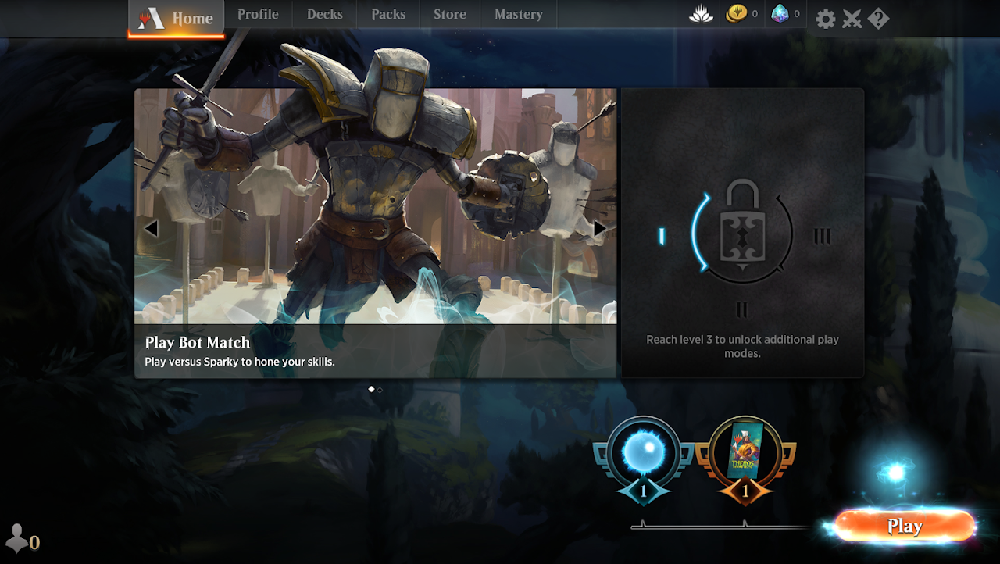
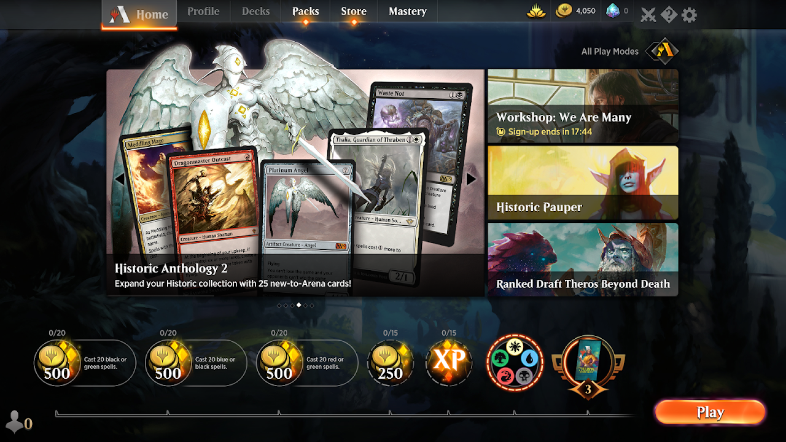
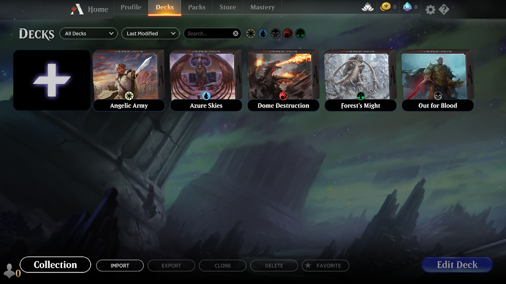
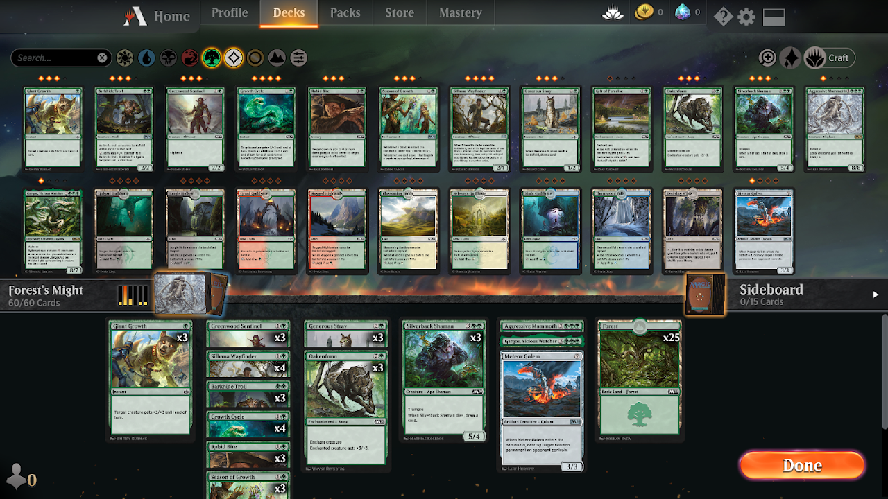

# 開始玩Arena

## 簡略介面說明

在你擊敗Nicol Bolas後遊戲會進入主選單。遊戲為了確定你已經準備好體驗所有Arena的內容，直到你完成一些任務或是在Options/Account開啟Unlock All Play Modes之前，許多介面都是隱藏起來的。

上方：點選不同分頁，分頁名字都恰如其名。

右上：wildcard(蓮花圖示)、你的黃金與寶石、遊戲選項與Direct Challenge(雙劍圖示)和一個Learn More的頁面。

在完整的遊戲介面中，右上方有一個在Arena Play Modes與All Play Modes之間切換的開關。請選擇"All"然後不要再管這不知道哪個天才想出來的開關。

中央：有一個自動輪播的遊戲消息與CTA看板。遊戲一開始只有兩個：挑戰Sparky與瀏覽Learn More，這兩個功能日後都能在其他選單中進入。在完整的遊戲介面中右處宣傳圖可以直接讓你進入遊戲活動中。

下方：每日與每週任務的進度條。懸停游標可以看到報酬。右處則是系列Mastery，還有[新手任務](#npe)進度。

右下：Play按鈕。點擊後會開啟一個可捲動的窗口以供選擇不同的遊戲模式進行遊玩。

蓮花圖示的顏色代表你目前wildcard中稀有度最高的等級。算是錦上添花的功能。有些時候你可能會看到活動券出現在蓮花左方。而出現在雙劍圖示左方的是Vault。

## 你的卡片收藏

你能夠在Decks分頁中看到你的卡片收藏，不過進入Decks(牌組)頁面後你第一眼會看到的是...對，你的牌組。

下方的按鈕有各種功能。Export會將所選套牌的卡表複製到剪貼簿讓你決定要怎麼使用。Import則是讀取卡表然後建立一個名為Imported Deck的牌組。許多網站的卡表格是都能直接拿來匯入，你可以試著自己輸出一次看看MTGA接受的卡表格式。

Collection則會開啟進入收藏瀏覽模式，搜尋欄位的右側有顏色篩選器和一個進階的[篩選器](https://forums.mtgarena.com/forums/threads/46567)，顏色篩選包含了無色與多色的卡片。右上角可以讓你決定瀏覽的卡片尺寸和全圖外觀造型，Craft篩選器可以讓你看到你尚未收藏或牌組清單缺少的卡片以供你造牌(類似進階篩選器中的Not Collected選項)，加號按鈕則會直接進入牌組建立模式。注意：如果你在途中改變了過濾項目會直接回到收藏卡片的開頭。

想要編輯牌組，你可以雙擊牌組。牌組編輯介面與收藏瀏覽介面相當相似外又增加了幾項功能：

- 點擊牌盒可以看到套牌的統計資訊與賽制選擇

- 點選套牌名稱可以直接輸入名字。你可以將卡片拉到牌盒上，會改變牌盒的封面

- 點選右上角矩形的圖示(Change Deck Layout)可以在水平與垂直的預覽模式之間切換。

當你建立套牌前記得先選好套牌的賽制，才能過濾掉那些不合法的牌張。

## 新手體驗與免費套牌

渡過New Player Experience(NPE)期後，會得到共計15副免費的牌組。最初的5副套牌是教學模式中贏來的，之後則要進行Color Challenges(五色挑戰)。

每個挑戰都由五場對決組成。最初的四場對決比較像是益智遊戲，所有的牌序都是計畫好的，這些對決為教育新手使用不同顏色套牌與其他對手對戰時的基礎觀念。這四場對決都是與AI進行，並且會得到一些卡片作獎賞供你升級牌組。第五場對決則是玩家之間進行，一般狀況下都是新玩家之間以自己改造的牌組進行對戰。第五場對戰將會給你wildcard與全圖外觀。

Color Challenges完成後遊戲會開始配布每日任務讓你贏得雙色牌組。鄰色牌組每完成一個任務會給一副，拿到五套鄰色牌組後還會有一個任務給你秘稀wildcard。最後一個任務會一次給你5套敵對色套牌。記得：當你完成NPE任務任務後，與AI對戰不會再累計任何任務進度。

> 譯註：所謂的鄰色(allied color)與敵對色(enemy color)是MTG通用術語，以五色白藍黑紅綠(WUBRG)環狀設計觀點出發描述顏色的相對關係。例如白色與藍色還有綠色彼此認同，因此藍色與綠色都是白色的鄰色。藍色與綠色在五環間是相對的，思想上彼此否定稱為敵對色。敵對色與鄰色的組合並沒有強弱之分，有不少強大的牌組都是敵對色組合。

升級過後的純色套牌將會個別擁有6張稀有卡。雙色套牌則包含6張稀有還有一個有價的雙色地。白色起始套牌中有些牌張是特別為Arena加入的，這些並不是真正標準合法的卡片。其他起始套牌的牌張都出自Guilds of Ravnica到Core Set 2020系列(除了純藍與純黑共有兩張來自Throne of Eldraine的卡片)。下次輪替序期將在2020年9月。

除Color Challenges給的卡片以外，升級起始套牌必須特別注意你所選的卡片，尤其是那些強力的牌張：起始套牌設計上是要與起始套牌對戰打個幾十場(非排名賽中)，如果你改得太強可能會被趕出兒童戲水池裡。

Arena的基礎地是免費的，但全圖基礎地外觀是付費造型，你可以透過消費或競賽取得。"Basic Lands"篩選項目可以讓你選擇或預覽全圖外觀。

## 貨幣與wildcard

與一般免費遊玩的遊戲相同，Arena主要有兩種貨幣：透過遊玩與勝場獲得的黃金，還有以付費獲得的高級貨幣寶石。大部分的活動與補充包購買都接受這兩種貨幣，但現開賽則不可以黃金入場。大部分的造型外觀都只能以寶石購買，不過也有只能以黃金購買的品項存在。

沒有任何一種通用的公式與方法可以換算寶石與黃金，根據遊戲活動的不同它們之間的比例也不同。以兩種貨幣的收入管道而言，用黃金來買補充包、用寶石來參加活動比較合理。構築賽可以讓你賺到黃金。不花一毛錢就能拿到寶石的唯一方式是以黃金參加輪抽賽。如果你拿到第5張重複的卡片也能獲微量的寶石。

### 一般黃金收入

**每日任務**，一些簡單不需要獲勝的任務，例如"施放X個某色咒語"或"消滅X個生物"。你每天都會得到一個任務，你最多可以累積三個每日任務，每天都能重骰其中一個。每日任務的報酬不是500就是750黃金，通常重骰任務的目的是要把500黃金的任務換成750的。具體出現的機率分布目前還不得而知。如果你有空的任務槽，新任務會在UTC 09:00配布。

**每日勝場**，每天首15個勝場都能拿到報酬。首幾勝最優渥：首4勝可以賺到500至750不等。4勝以後的報酬則隨機是50至25黃金或卡片。每日勝場的報酬與每日任務的刷新時間相同。

### Wildcard

Arena中一種衍伸但關鍵的資源叫Wildcard(自由牌)。wildcard是你能取得(造出)自己需要牌張的方式之一。消耗(以WotC的說法叫兌換)wildcard可以取得對應稀有度的卡片來增加收藏，這裡要特別叮嚀：這是一種非常有價值而且珍貴的資源，尤其是稀有與秘稀等級的wildcard。

你沒辦法像其他遊戲裡把卡片磨成粉塵，你可以把wildcard當作類似形式的碎片、粉塵。取得wildcard的方式主要靠開補充包。另一種方式則靠Vault，不過對新手來說提Vault還太早。

## 一些有用的設定

遊戲語言可以在Options/Graphics切換。其他或音訊之類的你應該沒有問題。

Options/Gameplay的選項是否有用取決你對魔法風雲會有多少認識。特別挑出幾點：

- Auto Tap。讓系統選擇要如何產生法力加到法力池或要如何消耗法力。這個功能可以加速遊戲進行，但也會犯錯。想要的話你隨時都可以自己轉地。從法力池中手動選擇法力點數則需要啟動Full Control模式(見下文)

- Auto Order/Choose/Assign。如果你是魔法風雲會的新手建議開啟這些選項直到你了解規則。

> 譯註：新手可能不常遇到，但在某些狀況下你確實只會想要讓生物分配攻擊力在特定的阻擋者身上。

- Evergreen Keyword Reminders。如果你是魔法風雲會的新手，請開啟這個。大部分有經驗的玩家都不需要遊戲額外說明這些長青異能。

- Enable Gameplay Warnings。讓你系統在有些可能無意或有害的特定操作時警告你，例如你對自己的生物施放傷害或消滅咒語。

- Options/Gameplay頁面列出了一些(不過無法改變的)快捷鍵，有些值得額外解說：

  - Full Control。魔法風雲會的規則規範玩家在回合中必須詢問彼此有沒有要採取行動(也就是passing priority，優先權渡讓)。在現實中渡讓優先權的冗長過程主要靠對談來簡化。Arena裡則採現實中最罕見跳過優先權渡讓的方式來處理。這可以讓遊戲飛快地進行，但也代表著有些時候你要開啟Full Control請Arena停止跳過才能進行一些原本被允許的操作。最常見的狀況是你要回應自己的咒語或觸發式異能。如果需要我推薦你使用Hold Full Control，當你想恢復自動掠過機制時同樣透過`Ctrl+Shift`關閉，而不是用`Ctrl`只能處理一次優先權渡讓。除此之外點擊回合步驟或階段也可以有效在那段期間啟用Full Control。

  - Pass Turn。`Enter`與`Shift+Enter`有些差別，如果你想真的想要跳過任何事完全不在乎遊戲任何操作，請用左側的`Shift+Enter`。

  - Undo。撤銷你轉地產生魔力的行為。例如：你選錯地。
  
  - Float All。放過(Floating)所有法力表示你把法力加入法力池中卻沒有消耗(記得法力池中的法力會在每個階段與步驟切換間淨空)。舉例來說當你不在乎顏色且需要快速橫置15個法力生產源時，雙鍵`QQ`。或對其中一個按著`Q`。
  
  - Show Collection Overlay。當你在輪抽挑卡時，按住`Alt`可以看到你的收藏中有幾張相同的卡片。打勾圖示代表你已經湊滿4張了(基礎地也是如此)。

## 兌換碼

從公測至今每個在Arena發售的系列都會提供一個兌換碼免費送你三包該系列的補充包。有些卡片也可以透過兌換碼兌換，甚至還包含全圖外觀。兌換碼可以在商店頁面的右上角輸入。可以到[Reddit](https://www.reddit.com/r/MagicArena/comments/g1zxny/all_mtga_promo_codes_todate/)或[Card Game Base](https://cardgamebase.com/mtg-arena-codes/)查看。Ravnica與War of the Spark系列雖然標註有兌換期限，但直到2020年7月以後都還能兌換的樣子。

有些實體商品也會包含Arena的兌換代碼：

- 售前包。包含六包該系列的補充包，每個帳戶可兌換一次。

- 活動卡([請見](https://magic.wizards.com/en/events/promotions))。一包補充包，每個帳戶至多五個。

- Planeswalker套牌。提供完整牌組。不值得為了兌換成Arena牌組而購買這個商品。每個帳戶至多一次。

> 譯註：Planeswalker又稱為旅法師，官方正式翻譯是鵬洛客，但譯者非常不喜歡這個譯名故不採用。鵬洛客套牌的定位相當於新手套牌，包裝代表性的Planeswalker牌張只能透過該產品獲得，雖然可以在標準賽中使用但並沒有什麼強度。
